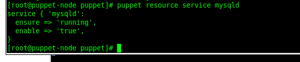

# lesson12

***Student***: [Aliaksei Khurhin](https://epa.ms/1Cqi0K)

All work was done on vagrant vm's, [Vagrantfile](Vagrantfile) with basic configuration is provided.

Command to install mysql module on master:
puppet module install puppetlabs-mysql

[Here](site.pp) you can see the manifest file and [logfile](node_mysql.log).

The result on the node:

